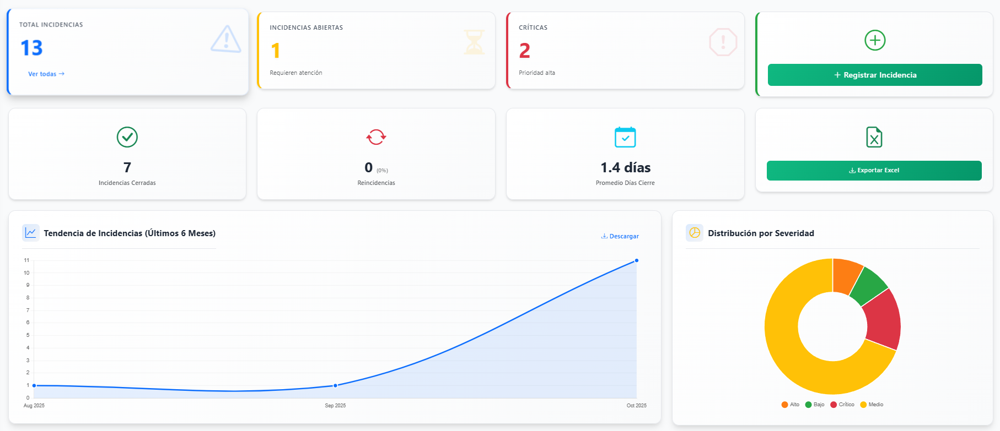
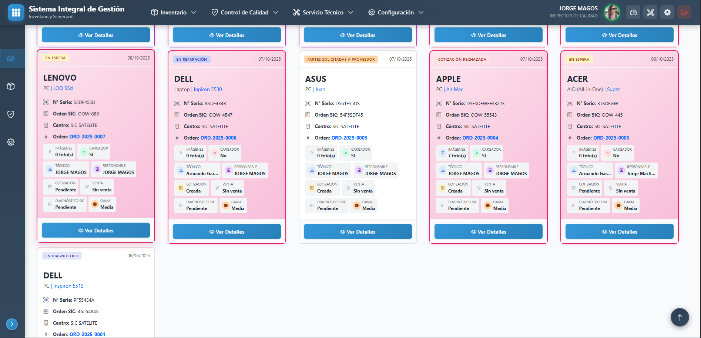
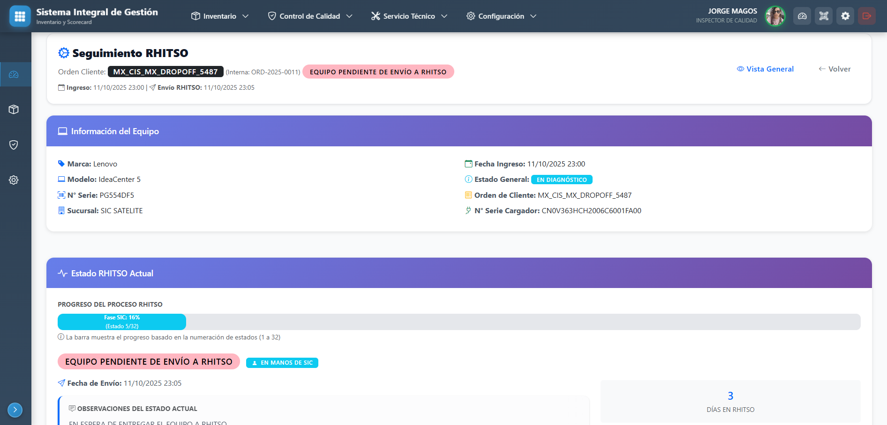
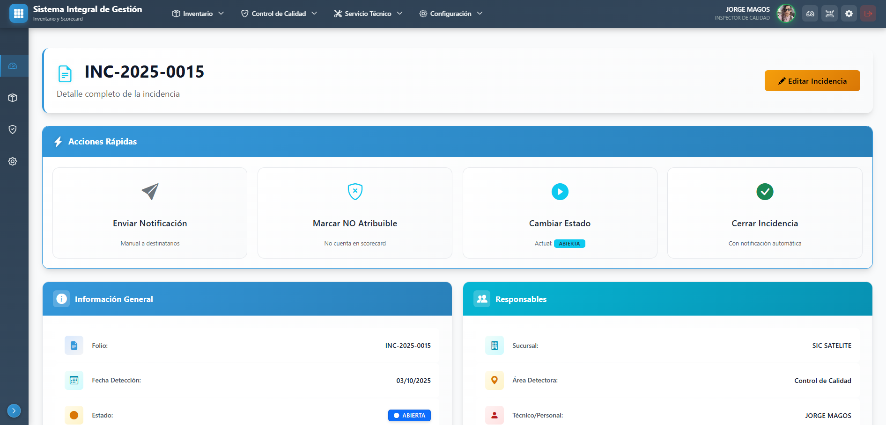
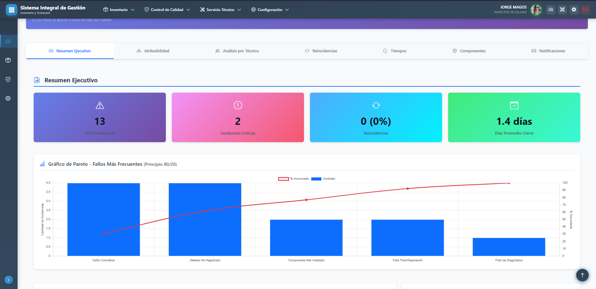
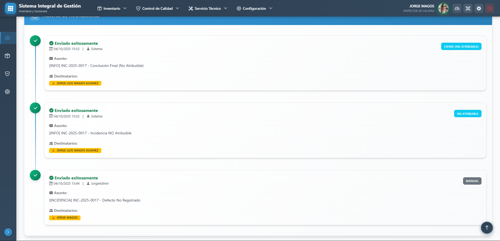

# 🏥 Sistema Integrado de Gestión Técnica y Control de Calidad

<!-- Badges -->
<p align="center">
  
  
  
  
</p>

<p align="center">
  
  
  
  
  
  
</p>

<p align="center">
  
  
  
  
</p>

---

**Sistema empresarial de última generación** para centros de servicio técnico de equipos de cómputo con **Machine Learning**, **Analytics avanzado**, **TypeScript frontend** y **arquitectura multi-país**.

Combina gestión de órdenes de servicio, control de calidad, **predicciones con IA**, **dashboards interactivos tipo Power BI**, seguimiento de incidencias, sistema RHITSO para casos complejos, **procesamiento en segundo plano con Celery + Redis**, **encuestas de satisfacción** y **seguimiento público para clientes fuera de garantía**.

---

## 📸 Capturas de Pantalla

### Dashboard Principal - Score Card

<p align="center">
  
  <br>
  <em>Dashboard interactivo con métricas en tiempo real, gráficas de tendencias y KPIs principales</em>
</p>

### Gestión de Órdenes de Servicio

<p align="center">
  
  <br>
  <em>Sistema de gestión de órdenes con 21 estados de seguimiento y filtros avanzados</em>
</p>

### Detalle de Orden con RHITSO

<p align="center">
  
  <br>
  <em>Vista detallada con seguimiento RHITSO, timeline de eventos e incidencias</em>
</p>

### Registro de Incidencias de Calidad

<p align="center">
  
  <br>
  <em>Formulario inteligente con autocompletado, detección de reincidencias y drag & drop de imágenes</em>
</p>

### Reportes Avanzados con 7 Tabs

<p align="center">
  
  <br>
  <em>Sistema de reportes con Pareto, heatmaps, análisis de atribuibilidad y exportación Excel</em>
</p>

### Sistema de Notificaciones

<p align="center">
  
  <br>
  <em>Historial de notificaciones enviadas con seguimiento de éxito/fallo</em>
</p>

> **Nota**: Las capturas de pantalla se encuentran en la carpeta [`docs/screenshots/`](./docs/screenshots/). Si no las ves, significa que aún no se han agregado al repositorio.

---

## 🎯 Módulos Principales del Sistema

### 1️⃣ **Servicio Técnico** - Gestión de Órdenes de Reparación

**Módulo**: `servicio_tecnico`

Sistema completo de órdenes de servicio técnico con flujo dual:

- **📋 Diagnóstico y Cotización**: Evaluación técnica → Cotización → Aprobación cliente → Reparación
- **🛍️ Venta Mostrador**: Servicios directos sin diagnóstico (formateos, instalaciones, upgrades)
- **🔄 Sistema Híbrido**: Una orden puede combinar ambos flujos (diagnóstico + ventas adicionales)

**Características principales:**

- ✅ Gestión completa del ciclo de vida de reparaciones
- ✅ 21 estados de seguimiento (desde ingreso hasta entrega)
- ✅ **Autocompletado Inteligente**: Buscador avanzado de modelos de equipos con `ReferenciaGamaEquipo` y `Select2`.
- ✅ Sistema de cotización con gestión de piezas y proveedores
- ✅ Seguimiento de piezas solicitadas (WPB, DOA, PNC)
- ✅ Referencias de gama de equipos para cotización rápida
- ✅ Historial completo de eventos por orden
- ✅ Sistema de imágenes con tipos (ingreso, diagnóstico, reparación, entrega, packing)
- ✅ **Cámara Integrada**: Captura de fotos directamente desde dispositivos móviles con selector de lentes, orientación híbrida y UI minimalista
- ✅ **Envío de Diagnóstico por PDF**: Generación automática de PDF con componentes dinámicos y mano de obra editable, enviado al cliente por correo
- ✅ **Seguimiento Público OOW/FL**: Portal de seguimiento para clientes de órdenes fuera de garantía con galería de imágenes y timeline
- ✅ **Dashboard OOW/FL**: Panel de métricas para seguimiento de clientes fuera de garantía con filtros avanzados
- ✅ **Encuestas de Satisfacción**: Sistema NPS con envío automático por correo y dashboard de resultados
- ✅ **Concentrado Semanal CIS**: Reporte semanal con exportación a Excel mensual
- ✅ **Correo de Cotización Rechazada**: Notificación con feedback del cliente mediante token seguro
- ✅ Venta mostrador con paquetes predefinidos y servicios adicionales
- ✅ Integración con sistema de calidad para reingresos
- ✅ **Buscador Inteligente de Reingresos**: Búsqueda de orden original con chip visual

**Estados del flujo:**

```
INGRESO → ASIGNADO → EN DIAGNÓSTICO → DIAGNÓSTICO ENVIADO →
EQUIPO DIAGNOSTICADO → COTIZACIÓN ENVIADA → CLIENTE ACEPTA →
PIEZAS SOLICITADAS → PIEZAS RECIBIDAS → EN REPARACIÓN →
REPARACIÓN COMPLETADA → CONTROL CALIDAD → LISTO PARA ENTREGA → ENTREGADO
```

**Casos especiales:**

- WPB (Wrong Part Bought): Pieza incorrecta
- DOA (Dead On Arrival): Pieza dañada
- PNC (Part Not Compatible): Parte no disponible
- Cliente rechaza cotización

---

### 2️⃣ **Score Card de Calidad** - Control de Calidad e Incidencias

**Módulo**: `scorecard`

Sistema avanzado de registro y análisis de incidencias de calidad en reparaciones.

**Características principales:**

- ✅ Registro detallado de incidencias con 4 niveles de severidad (Baja, Media, Alta, Crítica)
- ✅ Clasificación por tipo de fallo (Estético, Funcional, Software, Hardware, Documentación)
- ✅ **Sistema de Atribuibilidad**: Distingue entre errores atribuibles al técnico vs. causas externas
- ✅ Detección automática de reincidencias por número de serie
- ✅ Gestión de evidencias fotográficas con drag & drop
- ✅ **Sistema de Notificaciones por Email**: Automatizado y manual con múltiples destinatarios
- ✅ Workflow completo: Abierta → En Revisión → Reincidente → Cerrada
- ✅ Seguimiento de componentes defectuosos
- ✅ Justificaciones para incidencias NO atribuibles

**Dashboard de Métricas:**

- 📊 KPIs en tiempo real (Total incidencias, Tasa de reincidencia, Promedio de cierre)
- 📈 Gráficas de tendencias y análisis
- 🏆 Ranking de técnicos por desempeño
- 📉 Análisis de Pareto de fallos más frecuentes

**Reportes Avanzados con 7 Tabs:**

1. **Resumen Ejecutivo**: KPIs, Pareto, Heatmaps, Tendencias
2. **Atribuibilidad**: Análisis de responsabilidad técnica
3. **Por Técnico**: Scorecard individual de cada técnico
4. **Reincidencias**: Cadenas de reincidencias detectadas
5. **Tiempos**: Análisis de tiempos de cierre y alertas
6. **Componentes**: Componentes más problemáticos
7. **Notificaciones**: Análisis del sistema de emails

**Exportación:**

- 📥 Excel completo con múltiples hojas de análisis
- 🖨️ Impresión optimizada de reportes

---

### 3️⃣ **Sistema RHITSO** - Seguimiento de Reparaciones Complejas

**Módulo**: `servicio_tecnico` (submódulo)

Subsistema especializado para reparaciones que requieren seguimiento externo con RHITSO (proveedor/partner).

**Características principales:**

- ✅ 12 estados específicos de seguimiento RHITSO
- ✅ Gestión de múltiples owners (Dell, HP, Lenovo, Asus, etc.)
- ✅ Clasificación por complejidad (Simple, Moderada, Compleja)
- ✅ Registro de incidencias durante reparación externa
- ✅ Sistema de notificaciones automáticas por cambios de estado
- ✅ Generación de PDFs con resumen completo
- ✅ Cálculo de días hábiles para SLA
- ✅ Paleta de colores distintiva para identificación visual

**Estados RHITSO:**

```
PENDIENTE ENVÍO → ENVIADO RHITSO → RECIBIDO RHITSO →
EN DIAGNÓSTICO RHITSO → COTIZADO → APROBADO → EN REPARACIÓN →
REPARADO → ENVIADO RETORNO → RECIBIDO → PROBADO → FINALIZADO
```

**Incidencias RHITSO:**

- Gravedad: Baja, Media, Alta, Crítica
- Impacto al cliente: Ninguno, Bajo, Medio, Alto
- Prioridad: Baja, Normal, Alta, Urgente
- Seguimiento completo con notificaciones

---

### 4️⃣ **Inventario** - Gestión de Productos Base

**Módulo**: `inventario`

Módulo base de gestión de productos con control de calidad simple.

**Características:**

- ✅ CRUD completo de productos
- ✅ Control de calidad (Bueno, Regular, Malo)
- ✅ Gestión de sucursales y empleados (base compartida)
- ✅ Sistema de usuarios con roles personalizados

---

### 5️⃣ **Almacén Central** - Gestión Integral de Suministros y Piezas

**Módulo**: `almacen`

Sistema avanzado para el control de inventario de almacén central, compras y trazabilidad de piezas.

**Características principales:**

- ✅ **Gestión de Stock Dual**: Productos resurtibles (consumibles) y unidades únicas (piezas con número de serie).
- ✅ **Workflow de Compras**: Ciclo completo desde Solicitud de Cotización → Aprobación → Compra → Recepción.
- ✅ **Cotización Multi-proveedor**: Comparativa de precios y tiempos de entrega entre múltiples proveedores para una misma necesidad.
- ✅ **Trazabilidad 100%**: Seguimiento individual de piezas desde la compra hasta su asignación a una Orden de Servicio.
- ✅ **Auditorías de Inventario**: Sistema de conteo físico vs. sistema con registro de diferencias y ajustes.
- ✅ **Solicitudes de Baja**: Flujo de aprobación para descarte de material dañado o antiguo con registro fotográfico.
- ✅ **Transferencias**: Movimientos de mercancía controlados entre diferentes sucursales.
- ✅ **SVG Dinámico**: Visualización interactiva de categorías mediante iconos animados.

**Workflow de Adquisición:**
```
SOLICITUD DE COTIZACIÓN → ENVÍO A PROVEEDORES → RECEPCIÓN DE OFERTAS → 
ELECCIÓN DE MEJOR OPCIÓN → APROBACIÓN GERENCIAL → ORDEN DE COMPRA → 
SEGUIMIENTO DE ENVÍO → RECEPCIÓN EN ALMACÉN → INGRESO A STOCK
```

---

## 🚀 Funcionalidades Destacadas del Sistema

### 🔐 Sistema de Autenticación, Permisos y Seguridad

- Login personalizado con usuarios de Django
- Relación Usuario ↔ Empleado para gestión completa
- Forzado de cambio de contraseña en primer inicio
- **Permisos granulares por Django Groups**: Decoradores `@permission_required` en todas las vistas
- **Protección Brute-Force**: Bloqueo automático ante múltiples intentos fallidos (django-axes)
- **Rate Limiting**: Protección de vistas públicas con `django-ratelimit`
- **Validación de Credenciales**: Sistema robusto de validación de fortaleza de contraseñas

---

## 🌍 Sistema Multi-País

### Arquitectura Multi-Tenant por Subdominio

El sistema soporta operaciones en múltiples países con bases de datos independientes:

- **México** (`mexico.sigmasystem.work`) - Operación principal
- **Argentina** (`argentina.sigmasystem.work`) - Operación secundaria

**Características:**

- ✅ **Middleware de País**: Detección automática por subdominio con `PaisMiddleware`
- ✅ **Database Router**: Enrutamiento automático de consultas a la BD correcta por país
- ✅ **Configuración Centralizada**: `config/paises_config.py` con timezone, moneda, empresa por país
- ✅ **Banderas SVG Animadas**: Indicador visual del país activo en navbar
- ✅ **Context Processors**: Variables de país disponibles en todos los templates
- ✅ **Media Segregado**: Archivos de cada país en subcarpetas independientes

---

## ⚡ Celery + Redis - Procesamiento en Segundo Plano

### Tareas Asíncronas y Cache

- ✅ **Celery Workers**: Procesamiento de correos electrónicos en segundo plano (RHITSO, diagnóstico, imágenes, encuestas)
- ✅ **Celery Beat**: Tareas programadas (notificación automática de encuestas pendientes)
- ✅ **Redis Cache**: Cache de dashboards pesados (RHITSO, OOW/FL, cotizaciones, piezas) para respuesta inmediata
- ✅ **Panel de Notificaciones (🔔)**: Campanita con polling adaptativo, soporte móvil y eliminación individual
- ✅ **App `notificaciones`**: Módulo dedicado con modelo `Notificacion` y vistas REST

---

## 🏗️ Infraestructura y Almacenamiento

### Gestión de Datos y Conectividad

- **Almacenamiento Dual**: Sistema configurado para gestión dinámica entre discos (Soporte hasta 1TB)
- **Cloudflare Tunnel**: Configuración segura para acceso remoto en producción sin apertura de puertos (con validación SSL estricta)
- **Backup Automatizado**: Scripts mensuales/diarios para PostgreSQL y SQLite
- **Soporte SVG**: Visualización optimizada de gráficos vectoriales en todo el sistema
- **ManifestStaticFilesStorage**: Cache busting automático de archivos estáticos
- **PWA (Progressive Web App)**: Instalable en Android e iOS como app nativa con soporte para notch/Dynamic Island

---

## 🤖 Machine Learning & Inteligencia Artificial

### Sistema ML Avanzado (`ml_advanced/`)

El sistema integra un módulo completo de Machine Learning con 4 componentes especializados:

#### 1. **Optimizador de Precios con ML**

- **Archivo**: `optimizador_precios.py` (21KB)
- **Funcionalidad**:
  - Predicción de precios óptimos para cotizaciones
  - Análisis de elasticidad de precios por gama y marca
  - Recomendaciones basadas en histórico de aceptación
  - Ajuste automático según patrones de comportamiento del cliente

#### 2. **Análisis de Motivos de Rechazo**

- **Archivo**: `motivo_rechazo.py` (24KB)
- **Funcionalidad**:
  - Clasificación automática de rechazos
  - Predicción de probabilidad de rechazo pre-envío
  - Identificación de patrones en rechazos por técnico/sucursal
  - Sugerencias inteligentes para mejorar tasa de aceptación

#### 3. **Recomendador de Acciones**

- **Archivo**: `recomendador_acciones.py` (29KB)
- **Funcionalidad**:
  - Sistema de recomendaciones inteligentes basado en contexto
  - Predicción de próximas acciones necesarias por orden
  - Optimización de flujo de trabajo
  - Alertas proactivas basadas en ML

#### 4. **Predictor de Servicio Técnico**

- **Archivo**: `ml_predictor.py` (21KB)
- **Funcionalidad**:
  - Predicción de tiempo de reparación estimado
  - Estimación de probabilidad de fallo/reincidencia
  - Análisis de tendencias de servicio
  - Detección de anomalías en procesos

---

## 📊 Dashboard Analytics Avanzado (Tipo Power BI)

### Sistema de Visualizaciones Interactivas con Plotly

**Archivo**: `plotly_visualizations.py` (3939 líneas, 148KB)

Clase `DashboardCotizacionesVisualizer` con **50+ métodos de visualización** que generan gráficos HTML interactivos profesionales:

**Gráficos Implementados:**

- **Temporales**: Evolución de cotizaciones, comparativos entre períodos, tendencias
- **Distribución**: Histogramas + Boxplots de costos, análisis de rangos
- **Jerárquicos**: Sunburst (Gama → Tipo → Marca), Sankey (flujos), Treemap
- **Avanzados**: Heatmaps de desempeño, Pareto, rankings dinámicos, matrices de correlación

**Características Destacadas:**

- ✅ **Totalmente interactivo**: Zoom, pan, hover tooltips, click events
- ✅ **Paleta Bootstrap**: Colores consistentes con el diseño del sistema
- ✅ **Responsive**: Mobile-friendly y adaptable
- ✅ **Exportación**: PNG, SVG, PDF desde el navegador
- ✅ **Performance**: Optimizado para grandes volúmenes de datos

**Tipos de Análisis:**

- Tasas de aceptación por sucursal/técnico/gama
- Evolución temporal (diario, semanal, mensual)
- Top piezas rechazadas/aceptadas
- Distribución de costos y outliers
- Análisis de sugerencias técnicas vs. solicitudes de cliente
- Efectividad de cotizaciones por categoría

---

## 💻 TypeScript Integration - Frontend Type-Safe

### Stack Frontend Moderno

El sistema utiliza **TypeScript 5.9.3** para desarrollo frontend profesional y mantenible.

**Configuración**:

- `tsconfig.json` - Strict mode, ES2018 target
- Compilación automática: `static/ts/` → `static/js/`
- Source maps para debugging
- Types de Bootstrap incluidos (@types/bootstrap)

**Módulos TypeScript** (30 archivos, ~19,600 líneas):

1. **`base.ts`** (689 líneas) - Funcionalidad base compartida, utilities y helpers
2. **`camara_integrada.ts`** (1,579 líneas) - Sistema de cámara nativa con selector de lentes y orientación híbrida
3. **`upload_imagenes_dual.ts`** (2,248 líneas) - Subida de imágenes con reintentos automáticos anti-Cloudflare
4. **`diagnostico_modal.ts`** (2,458 líneas) - Modal de envío de diagnóstico con PDF y componentes dinámicos
5. **`lightbox_galeria.ts`** (1,100 líneas) - Sistema de galería con modo inspección y navegación
6. **`solicitud_baja_form.ts`** (1,086 líneas) - Formularios de solicitud de baja con workflow
7. **`dashboard_rhitso.ts`** (769 líneas) - Timeline RHITSO, estadísticas en tiempo real
8. **`dashboard_encuestas.ts`** (774 líneas) - Dashboard de encuestas de satisfacción NPS
9. **`dashboard_cotizaciones.ts`** (603 líneas) - Dashboard interactivo con filtros dinámicos
10. **`dashboard_seguimiento_piezas.ts`** (583 líneas) - Tracking WPB, DOA, PNC
11. **`scorecard_form.ts`** (610 líneas) - Formularios con detección de reincidencias
12. **`busqueda_reingreso.ts`** (642 líneas) - Buscador inteligente de órdenes originales con chip
13. **`busqueda_ordenes.ts`** (555 líneas) - Búsqueda con autocompletado y paginación
14. **`concentrado_semanal.ts`** (584 líneas) - Concentrado CIS con reporte mensual
15. **`notificaciones.ts`** (570 líneas) - Panel de notificaciones con polling adaptativo
16. **`dashboard_feedback_rechazo.ts`** (531 líneas) - Análisis de rechazos por costo y piezas
17. **`dashboard_seguimiento_enlaces.ts`** (464 líneas) - Dashboard de seguimiento público OOW
18. **`modelo_autocomplete.ts`** (364 líneas) - Autocompletado de modelos de equipos
19. **`modelo_autocomplete_modal.ts`** (460 líneas) - Modal de autocompletado avanzado
20. **`form_compra.ts`** (457 líneas) - Formularios de compra de almacén
21. **`password-validator.ts`** (448 líneas) - Validación de fortaleza de contraseñas
22. **`galeria_seguimiento.ts`** (394 líneas) - Galería de seguimiento público
23. **`dashboard-distribucion-sucursales.ts`** (370 líneas) - Distribución multi-sucursal
24. **`feedback_satisfaccion.ts`** (332 líneas) - Formulario de encuesta con partículas
25. **`plantillas_rechazo.ts`** (247 líneas) - Gestión de plantillas con autocompletado
26. **`historial_orden.ts`** (234 líneas) - Timeline de historial de orden
27. **`login_particles.ts`** (181 líneas) - Efectos de partículas, canvas interactivo
28. **`feedback_particles.ts`** (139 líneas) - Partículas animadas en encuestas
29. **`unidades_agrupadas.ts`** (135 líneas) - Agrupación de unidades de inventario
30. **`globals.d.ts`** - Declaraciones de tipos globales

**Ventajas del TypeScript:**

- ✅ Type safety en todo el frontend
- ✅ Autocompletado inteligente en IDEs
- ✅ Refactoring seguro sin romper funcionalidad
- ✅ Detección temprana de errores
- ✅ Mejor mantenibilidad y escalabilidad del código

**Scripts disponibles**:

```bash
npm run build  # Compilar TypeScript a JavaScript
npm run watch  # Modo watch para desarrollo (recompila automáticamente)
```

---

### 📧 Sistema de Notificaciones por Email

**Configurado con Gmail SMTP + Celery (segundo plano)**

- Notificaciones automáticas de incidencias
- Envío manual con múltiples destinatarios
- **Procesamiento asíncrono con Celery**: Correos no bloquean vistas del usuario
- Plantillas profesionales con branding estandarizado
- **WhatsApp dinámico**: Contacto en footer de emails
- Historial completo de notificaciones enviadas
- Seguimiento de éxito/fallo de envíos
- **Correo de diagnóstico**: PDF adjunto con componentes y mano de obra
- **Correo de cotización rechazada**: Con token seguro para feedback
- **Correo de encuesta de satisfacción**: Enlace con token único
- **Correo de imágenes de egreso**: Notificación al finalizar

### 📊 Sistema de Reportes y Análisis

- **Dashboards interactivos con Plotly**: 50+ visualizaciones tipo Power BI
- **Chart.js**: Gráficas básicas complementarias
- Filtros avanzados (fechas, sucursales, técnicos, severidad, etc.)
- Exportación a Excel con múltiples hojas y análisis estadístico
- Gráficas dinámicas: Pareto, Sunburst, Sankey, Heatmaps, Rankings
- Análisis de reincidencias y tiempos de resolución
- **Machine Learning**: Predicciones y recomendaciones inteligentes
- **Dashboard de Rechazos**: Análisis por costo y número de piezas
- **Concentrado Semanal CIS**: Reporte con exportación Excel mensual
- **Dashboard de Encuestas NPS**: Análisis de satisfacción del cliente
- **Distribución Multi-Sucursal**: Vista con exportación Excel

### 📱 Interfaz de Usuario Moderna

- **TypeScript 5.9.3**: Frontend type-safe con 30 módulos (~19,600 líneas)
- **Glassmorphism UI**: Efectos 3D y transparencias modernas
- **Particle Effects**: Canvas interactivo en login/logout y encuestas
- Diseño responsivo con Bootstrap 5.3.2
- **Cámara Integrada**: Captura nativa desde móviles con selector de lentes y orientación 270°
- Drag & Drop avanzado para carga de imágenes con reintentos automáticos
- Autocompletado inteligente en formularios
- Pestañas dinámicas para organización de datos
- **Lightbox Gallery**: Sistema completo con modo inspección y navegación (TypeScript)
- **PWA Nativa**: Instalable en Android e iOS con soporte para notch/Dynamic Island
- **Banderas SVG Animadas**: Indicador visual de país en navbar
- Sistema de badges con colores semánticos

### 🔄 APIs REST Internas

- Endpoints para carga dinámica de datos
- Autocompletado de campos por relaciones
- Filtrado de componentes por tipo de equipo
- Búsqueda de reincidencias en tiempo real
- Datos para gráficas y reportes

---

## 📋 Características Técnicas

### Backend (Django 5.2.5)

- **Arquitectura MVC** con separación de responsabilidades
- **ORM avanzado** con relaciones complejas (OneToOne, ForeignKey, ManyToMany)
- **Signals de Django** para automatizaciones (cambios de estado, notificaciones)
- **Validaciones personalizadas** a nivel de modelo y formulario
- **Sistema de archivos** con gestión de media uploads por país
- **Custom Template Tags y Filters** para lógica de presentación
- **APIs REST** con JsonResponse para frontend dinámico
- **Machine Learning Models** integrados en el flujo de trabajo
- **Celery + Redis** para procesamiento asíncrono de correos y tareas programadas
- **Redis Cache** para dashboards pesados con invalidación automática
- **Multi-País** con middleware, DB router y configuración centralizada
- **Rate Limiting** con `django-ratelimit` en vistas públicas
- **ManifestStaticFilesStorage** para cache busting automático

### Frontend Moderno

- **TypeScript 5.9.3** - Type-safe development (30 módulos, ~19,600 líneas)
- **Plotly.js** - Dashboards interactivos tipo Power BI
- **Bootstrap 5.3.2** - Framework CSS responsivo
- **Bootstrap Icons** - Iconografía consistente
- **Chart.js 4.4.0** - Gráficas básicas complementarias
- **JavaScript ES2018+** - Interactividad moderna
- **CSS modular** organizado por responsabilidad
- **Glassmorphism & 3D Effects** - UI de última generación
- **Drag & Drop API** nativa para carga de archivos
- **Cámara Integrada** - Captura nativa desde móviles (TypeScript)

### Data Science & Analytics

- **Plotly 6.3.0** - Visualizaciones interactivas profesionales
- **Pandas 2.3.0** - Análisis y manipulación de datos
- **Scikit-learn 1.5.0** - Machine Learning models
- **Matplotlib 3.9.0** - Gráficos estadísticos
- **Seaborn 0.13.0** - Visualizaciones estadísticas avanzadas
- **NumPy** - Cálculos numéricos eficientes

### Base de Datos

- **SQLite3** (desarrollo) / **PostgreSQL** (producción)
- **Multi-Database**: Base de datos independiente por país con `DatabaseRouter`
- **Migraciones versionadas** con Django Migrations
- **Índices optimizados** para consultas frecuentes
- **Connection Pooling**: `CONN_MAX_AGE=600` en PostgreSQL
- **Backup automatizado** de base de datos

### Seguridad

- **CSRF Protection** habilitada
- **Sanitización de inputs** con validadores Django
- **Permisos granulares** por modelo con Django Groups
- **Passwords hasheados** con PBKDF2
- **Variables de entorno** (.env) para configuración sensible
- **django-axes**: Bloqueo ante múltiples intentos fallidos
- **django-ratelimit**: Protección de vistas públicas contra abuso
- **Tokens seguros**: Para enlaces de feedback y encuestas
- **Cloudflare SSL**: Validación estricta en producción

---

## 🗄️ Modelos de Datos Principales

### Servicio Técnico

- **OrdenServicio**: Orden principal (21 estados posibles)
- **DetalleEquipo**: Información técnica del equipo
- **ReferenciaGamaEquipo**: Catálogo de modelos para autocompletado
- **Cotizacion**: Cotizaciones de reparación
- **PiezaCotizada**: Piezas en cotizaciones
- **SeguimientoPieza**: Tracking de piezas solicitadas
- **VentaMostrador**: Ventas directas
- **PiezaVentaMostrador**: Items de venta mostrador
- **ImagenOrden**: Evidencias fotográficas (5 tipos: ingreso, diagnóstico, reparación, entrega, packing)
- **HistorialOrden**: Eventos de auditoría
- **EstadoRHITSO**: Estados de proceso RHITSO
- **CategoriaDiagnostico**: Categorías de diagnóstico
- **TipoIncidenciaRHITSO**: Tipos de incidencias RHITSO
- **SeguimientoRHITSO**: Fechas clave del proceso
- **IncidenciaRHITSO**: Problemas durante reparación externa
- **ConfiguracionRHITSO**: Configuración del subsistema RHITSO
- **FeedbackCliente**: Encuestas de satisfacción NPS con comentarios
- **EnlaceSeguimientoCliente**: Enlaces de seguimiento público para órdenes OOW/FL

### Score Card

- **Incidencia**: Registro de fallas de calidad
- **EvidenciaIncidencia**: Imágenes de incidencias
- **TipoIncidencia**: Categorización de fallos
- **ComponenteEquipo**: Catálogo de componentes
- **NotificacionIncidencia**: Historial de emails
- **DestinatarioNotificacion**: Destinatarios de notificaciones

### Almacén Central

- **ProductoAlmacen**: Productos consumibles y piezas únicas
- **UnidadInventario**: Rastreo individual por número de serie
- **Proveedor**: Catálogo de proveedores y contactos
- **CompraProducto**: Registro de adquisiciones
- **SolicitudCotizacion**: Gestión multi-proveedor
- **AuditoriaInventario**: Control de stock físico
- **SolicitudBaja**: Descarte de material con aprobación

### Inventario (Base)

- **Producto**: Productos en inventario base
- **Sucursal**: Sucursales de la empresa
- **Empleado**: Personal (técnicos, inspectores, etc.)

### Notificaciones

- **Notificacion**: Notificaciones internas del sistema con polling adaptativo

---

## 🎨 Paletas de Colores del Sistema

### Estados de Orden (21 estados)

- **Azul**: Ingreso/Recepción
- **Púrpura**: Diagnóstico
- **Naranja**: Cotización
- **Verde**: Aprobaciones
- **Amarillo**: Gestión de piezas
- **Cian**: Reparación
- **Verde oscuro**: Calidad
- **Rojo**: Rechazos/Problemas

### Severidad de Incidencias

- **Verde (#27ae60)**: Baja
- **Amarillo (#f39c12)**: Media
- **Naranja (#e67e22)**: Alta
- **Rojo (#e74c3c)**: Crítica

### Sistema RHITSO

- Paleta distintiva con colores Tailwind
- Estados claramente diferenciables
- Badges con contraste automático

---

## 📱 Rutas Principales del Sistema

### Servicio Técnico

- `/servicio/` - Lista de órdenes
- `/servicio/crear/` - Nueva orden
- `/servicio/<id>/` - Detalle de orden
- `/servicio/<id>/editar/` - Editar orden
- `/servicio/<id>/cotizacion/` - Crear cotización
- `/servicio/<id>/venta-mostrador/` - Crear venta
- `/servicio/rhitso/` - Gestión RHITSO
- `/servicio/concentrado-semanal/` - Concentrado Semanal CIS
- `/servicio/dashboard-oow/` - Dashboard de seguimiento OOW/FL
- `/servicio/seguimiento/<token>/` - Seguimiento público para clientes (OOW)
- `/servicio/encuesta/<token>/` - Encuesta de satisfacción (público)
- `/servicio/dashboard-encuestas/` - Dashboard de encuestas NPS
- `/servicio/dashboard-feedback-rechazo/` - Análisis de rechazos

### Score Card

- `/scorecard/` - Dashboard principal
- `/scorecard/incidencias/` - Lista de incidencias
- `/scorecard/incidencias/crear/` - Registrar incidencia
- `/scorecard/incidencias/<id>/` - Detalle con acciones
- `/scorecard/reportes/` - Reportes avanzados (7 tabs)
- `/scorecard/api/` - APIs REST internas

### Almacén Central

- `/almacen/` - Dashboard de almacén
- `/almacen/productos/` - Catálogo de productos y stock
- `/almacen/compras/` - Gestión de órdenes de compra
- `/almacen/solicitudes-cotizacion/` - Cotizaciones multi-proveedor
- `/almacen/auditorias/` - Control de inventario físico

### Sistema

- `/admin/` - Panel de administración Django
- `/login/` - Autenticación de usuarios
- `/` - Página principal (redirect según rol)
- `/notificaciones/` - API de notificaciones internas (polling)

---

## 🛠️ Instalación y Configuración

### Requisitos Previos

- Python 3.12+
- pip (gestor de paquetes Python)
- Node.js 18+ (para compilación TypeScript)
- Redis (para Celery y cache en producción)
- Git
- Cuenta Gmail (para notificaciones por email)

### Instalación

### Instalación

1. **Clonar el repositorio**

```bash
git clone https://github.com/maggots555/inventario-calidad-django.git
cd inventario-calidad-django
```

2. **Crear y activar entorno virtual**

```bash
python -m venv venv

# En Windows:
venv\Scripts\activate

# En macOS/Linux:
source venv/bin/activate
```

3. **Instalar dependencias**

```bash
pip install -r requirements.txt
```

4. **Configurar variables de entorno**

Crear archivo `.env` en la raíz del proyecto:

```env
# Django
SECRET_KEY=tu-secret-key-aqui
DEBUG=True
ALLOWED_HOSTS=localhost,127.0.0.1

# Base de datos (SQLite para desarrollo)
DB_ENGINE=django.db.backends.sqlite3
DB_NAME=db.sqlite3

# Email (Gmail)
EMAIL_HOST_USER=tu-email@gmail.com
EMAIL_HOST_PASSWORD=tu-app-password-gmail

# Notificaciones
CORREO_REMITENTE_NOMBRE=Sistema de Calidad
CORREO_REMITENTE_EMAIL=sistema@tuempresa.com

# Celery + Redis (producción)
CELERY_BROKER_URL=redis://localhost:6379/0
CELERY_RESULT_BACKEND=redis://localhost:6379/0

# Almacenamiento
PRIMARY_MEDIA_ROOT=/path/to/primary
ALTERNATE_MEDIA_ROOT=/path/to/alternate
MIN_FREE_SPACE_GB=10
```

**Obtener App Password de Gmail:**

1. Ir a [Cuenta de Google](https://myaccount.google.com/)
2. Seguridad → Verificación en dos pasos (activar)
3. Contraseñas de aplicaciones → Generar
4. Copiar el password de 16 caracteres

5. **Aplicar migraciones**

```bash
python manage.py migrate
```

6. **Crear superusuario**

```bash
python manage.py createsuperuser
```

7. **Poblar datos iniciales** (Opcional)

```bash
# Sucursales y empleados base
python scripts/poblado/poblar_sistema.py

# Catálogo de servicios
python scripts/poblado/poblar_servicios.py

# Estados RHITSO
python scripts/poblado/poblar_estados_rhitso.py

# Datos de ejemplo para Score Card
python scripts/poblado/poblar_scorecard.py
```

8. **Compilar TypeScript**

```bash
npm install
npm run build
```

9. **Ejecutar el servidor**

```bash
python manage.py runserver
```

10. **Acceder al sistema**

- Sistema: http://127.0.0.1:8000/
- Admin: http://127.0.0.1:8000/admin/

---

## 🎯 Uso del Sistema

### Para Recepcionistas

1. **Crear orden de servicio** desde `/servicio/crear/`
2. Capturar datos del cliente y equipo
3. Tomar fotos de ingreso
4. Asignar técnico responsable

### Para Técnicos

1. Ver órdenes asignadas en `/servicio/`
2. Actualizar estado a "En Diagnóstico"
3. Subir imágenes de diagnóstico
4. Crear cotización con piezas necesarias
5. Actualizar a "Reparación" tras aprobación
6. Marcar como "Control de Calidad" al terminar

### Para Control de Calidad

1. Revisar órdenes en "Control de Calidad"
2. Verificar funcionamiento del equipo
3. **Si encuentra problemas**: Registrar incidencia en Score Card
4. Aprobar o devolver a técnico
5. Cambiar estado a "Listo para Entrega"

### Para Inspectores de Calidad

1. Dashboard en `/scorecard/`
2. Registrar incidencias con evidencias
3. Enviar notificaciones a responsables
4. Marcar incidencias como NO atribuibles (si aplica)
5. Cerrar incidencias resueltas
6. Generar reportes ejecutivos

### Para Gerencia

1. Ver dashboard de Score Card
2. Analizar reportes avanzados (7 tabs)
3. Exportar Excel para análisis externo
4. Revisar métricas de técnicos
5. Identificar tendencias y áreas de mejora

---

## 📊 KPIs y Métricas del Sistema

### Servicio Técnico

- Órdenes activas por estado
- Tiempo promedio de reparación
- Tasa de aprobación de cotizaciones
- Órdenes en cada estado del flujo
- Días promedio por fase

### Score Card

- **Total de incidencias** (desglosado por estado)
- **Tasa de reincidencia** (% de equipos con 2+ incidencias)
- **Promedio días de cierre** (desde detección hasta cierre)
- **Top técnicos** (ranking por menor incidencias)
- **Componentes problemáticos** (más frecuentes)
- **Atribuibilidad** (% errores técnicos vs. externos)
- **Efectividad de notificaciones** (tasa de éxito de envíos)

### RHITSO

- Órdenes en proceso RHITSO por estado
- Tiempo promedio de reparación externa
- Incidencias durante proceso externo
- SLA cumplidos vs. vencidos

---

## 🔧 Scripts de Utilidades

Ver documentación completa en [`docs/README.md`](./docs/README.md)

### Poblado de Datos (`scripts/poblado/`)

- `poblar_sistema.py` - Sucursales, empleados, usuarios
- `poblar_servicios.py` - Catálogo de servicios
- `poblar_estados_rhitso.py` - Estados del proceso RHITSO
- `poblar_productos.py` - Productos de inventario
- `poblar_scorecard.py` - Datos de ejemplo Score Card

### Verificación (`scripts/verificacion/`)

- `verificar_datos.py` - Validación de integridad de datos
- `verificar_fase*.py` - Verificación por fase de implementación
- `actualizar_seguimientos_existentes.py` - Actualización masiva

### Testing (`scripts/testing/`)

- `test_email_config.py` - Prueba de configuración de email
- `test_pdf_rhitso.py` - Prueba de generación de PDFs
- `test_rhitso_config.py` - Validación de configuración RHITSO
- `test_compresion_imagenes.py` - Prueba de compresión de imágenes

---

## 📚 Documentación Completa

El proyecto incluye **42 documentos técnicos** organizados en [`docs/`](./docs/):

### Por Módulo

- **RHITSO**: 8 documentos (plan, fases, colores, PDFs)
- **Score Card**: 8 documentos (fases, atribuibilidad, notificaciones)
- **Venta Mostrador**: 11 documentos (changelogs, refactors, referencias)
- **Servicio Técnico**: 5 documentos (vistas, piezas, estados)

### Guías

- **Setup**: Configuración inicial, comandos Git
- **Referencias**: Colores, mejoras, planes de reportes

Ver índice completo en [`docs/README.md`](./docs/README.md)

---

## 🚦 Próximas Mejoras

### Corto Plazo

- [x] ~~Módulo de reportes PDF personalizados~~ ✅ (Diagnóstico PDF implementado)
- [ ] Firma digital del cliente en entregas
- [ ] App móvil para técnicos (seguimiento en campo)
- [x] ~~Integración con WhatsApp Business API~~ ✅ (WhatsApp dinámico en emails)
- [ ] Dashboard ejecutivo con métricas financieras

### Mediano Plazo

- [ ] Sistema de garantías automatizado
- [x] ~~Portal de clientes (consulta de órdenes)~~ ✅ (Seguimiento público OOW/FL)
- [ ] Integración con sistema de facturación
- [x] ~~IA para predicción de fallas recurrentes~~ ✅ (ML predictor implementado)
- [x] ~~Sistema de feedback del cliente~~ ✅ (Encuestas NPS + feedback de rechazo)

### Largo Plazo

- [x] ~~Multi-tenant para franquicias~~ ✅ (Sistema multi-país México/Argentina)
- [ ] Marketplace de refacciones
- [ ] Sistema de capacitación de técnicos
- [ ] Integración con ERPs empresariales

---

## Estructura del Proyecto

```
inventario-calidad-django/
├── config/                 # Configuración del proyecto Django
│   ├── settings.py        # Settings principal
│   ├── urls.py            # URLs raíz
│   ├── constants.py       # Constantes del sistema
│   ├── celery.py          # Configuración Celery
│   ├── paises_config.py   # Configuración multi-país
│   ├── middleware_pais.py # Middleware de detección de país
│   ├── db_router.py       # Database Router multi-país
│   ├── context_processors.py # Variables globales de templates
│   ├── storage_utils.py   # Almacenamiento dinámico
│   ├── media_views.py     # Servicio seguro de media
│   └── wsgi.py / asgi.py
├── servicio_tecnico/      # App principal de servicio técnico
│   ├── models.py          # 18 modelos
│   ├── views.py           # Vistas principales
│   ├── plotly_visualizations.py  # 3,949 líneas - Dashboards Plotly
│   ├── ml_predictor.py    # Predictor ML
│   ├── ml_advanced/       # ML avanzado (4 módulos)
│   ├── excel_exporters.py # Exportación Excel
│   └── templates/         # Templates del módulo
├── scorecard/             # App de control de calidad
├── inventario/            # App de inventario base
├── almacen/               # App de gestión de almacén central
├── notificaciones/        # App de notificaciones internas (Celery)
├── templates/             # Templates globales (base.html)
├── static/
│   ├── ts/                # 30 módulos TypeScript fuente (~19,600 líneas)
│   ├── js/                # JavaScript compilado (auto-generado)
│   ├── css/               # CSS organizado (base, components, forms)
│   └── images/            # Imágenes y SVGs
├── media/                 # Archivos subidos (organizados por país)
│   ├── mexico/
│   ├── argentina/
│   └── ...
├── docs/                  # 79 documentos técnicos
├── scripts/               # 72 scripts de utilidades
│   ├── poblado/           # Datos iniciales
│   ├── testing/           # Scripts de pruebas
│   ├── verificacion/      # Validación de datos
│   ├── migracion/         # Migraciones de datos
│   └── ml/                # Entrenamiento ML
├── ml_models/             # Modelos ML entrenados (.pkl)
├── logs/                  # Logs de aplicación
├── manage.py
├── requirements.txt
├── package.json           # Dependencias Node (TypeScript)
└── tsconfig.json          # Configuración TypeScript
```

> **📖 Documentación Completa**: Ver [`docs/README.md`](./docs/README.md) para acceso a toda la documentación técnica, guías de implementación y scripts de utilidades.

---

## 💡 Tecnologías Utilizadas

### Backend

- **Django 5.2.5** - Framework web Python
- **Python 3.12.3** - Lenguaje de programación
- **SQLite3** - Base de datos (desarrollo)
- **PostgreSQL** - Base de datos (producción) con connection pooling
- **Celery 5.3+** - Tareas asíncronas en segundo plano
- **Redis 5.4+** - Broker de mensajes y cache
- **django-celery-beat** - Tareas programadas
- **Pillow** - Procesamiento de imágenes
- **openpyxl** - Exportación Excel avanzada
- **ReportLab** - Generación de PDFs
- **Plotly** - Visualizaciones servidor-side
- **Pandas** - Procesamiento y análisis de datos
- **Scikit-learn** - Machine Learning
- **Matplotlib & Seaborn** - Análisis estadístico
- **django-axes** - Protección contra brute-force
- **django-ratelimit** - Rate limiting de vistas públicas

### Frontend

- **TypeScript 5.9.3** - Type-safe development (30 módulos)
- **Plotly.js** - Dashboards interactivos tipo Power BI
- **Bootstrap 5.3.2** - Framework CSS
- **Bootstrap Icons** - Iconografía
- **Chart.js 4.4.0** - Gráficas básicas
- **JavaScript ES2018+** - Interactividad moderna
- **Glassmorphism & 3D Effects** - UI de última generación

### DevOps & Herramientas

- **Git** - Control de versiones
- **Celery + Redis** - Cola de tareas y cache
- **Cloudflare Tunnel** - Acceso remoto seguro sin puertos abiertos
- **Nginx** - Proxy inverso en producción
- **Linux (Producción)** / **Windows (Desarrollo)**
- **VS Code** - Editor recomendado
- **Django Debug Toolbar** - Debugging (dev)

---

## 👥 Contribuir

1. Fork del proyecto
2. Crear rama para nueva funcionalidad (`git checkout -b feature/NuevaCaracteristica`)
3. Commit de cambios (`git commit -m 'Agregar nueva característica'`)
4. Push a la rama (`git push origin feature/NuevaCaracteristica`)
5. Crear Pull Request

**Código de Conducta:**

- Seguir convenciones de Django
- Documentar código complejo
- Incluir tests para nuevas features
- Mantener compatibilidad con versiones anteriores

---

## 📄 Licencia

Este proyecto está licenciado bajo la **GNU General Public License v3.0**.

Copyright © 2025-2026 Jorge Magos (maggots555)

Este programa es software libre: puedes redistribuirlo y/o modificarlo bajo los términos de la GNU General Public License publicada por la Free Software Foundation, ya sea la versión 3 de la Licencia, o (a tu elección) cualquier versión posterior.

Este programa se distribuye con la esperanza de que sea útil, pero SIN NINGUNA GARANTÍA; ni siquiera la garantía implícita de COMERCIABILIDAD o IDONEIDAD PARA UN PROPÓSITO PARTICULAR. Vea la GNU General Public License para más detalles.

Consulte el archivo [LICENSE](./LICENSE) para ver el texto completo de la licencia.

---

## 📞 Soporte y Contacto

**Desarrollador**: Sistema Integrado de Gestión Técnica  
**Repositorio**: [github.com/maggots555/inventario-calidad-django](https://github.com/maggots555/inventario-calidad-django)

**Documentación Técnica**: Ver [`docs/README.md`](./docs/README.md) para documentación detallada de cada módulo.

---

## 🏆 Reconocimientos

Este sistema integra las mejores prácticas de:

- **Django Documentation** - Arquitectura MVC
- **Bootstrap** - Diseño responsivo
- **Plotly** - Visualizaciones interactivas profesionales
- **TypeScript** - Type-safe frontend development
- **Scikit-learn** - Machine Learning best practices
- **Chart.js** - Visualización de datos
- **Metodologías Lean** - Optimización de procesos

---

## 📈 Estado del Proyecto

**Versión Actual**: 4.0 (Marzo 2026)  
**Estado**: ✅ Producción (6 módulos integrados + ML/Analytics/Multi-País/Celery)  
**Última Actualización**: Marzo 19, 2026

### Módulos Completados

- ✅ **Inventario** (v1.0) - Sistema base
- ✅ **Servicio Técnico** (v3.0) - Con RHITSO, cámara integrada, seguimiento OOW/FL, encuestas NPS, diagnóstico PDF
- ✅ **Score Card** (v2.2) - Con reportes avanzados y notificaciones optimizadas
- ✅ **RHITSO** (v1.5) - Seguimiento externo con motivos detallados
- ✅ **Almacén Central** (v1.0) - Compras, Cotizaciones y Stock único
- ✅ **Notificaciones** (v1.0) - Panel campanita con Celery + polling adaptativo

### Estadísticas del Sistema

- **21 estados** de orden de servicio
- **12 estados** RHITSO
- **4 niveles** de severidad de incidencias
- **7 tabs** de reportes avanzados
- **50+ visualizaciones** Plotly interactivas tipo Power BI
- **30 módulos** TypeScript (~19,600 líneas)
- **4 sistemas** ML/IA especializados (con soporte para etiquetas nuevas)
- **79 documentos** técnicos
- **72 scripts** de utilidades
- **86,000+ líneas** de código Python
- **19,600+ líneas** de TypeScript
- **45,700+ líneas** de templates Django
- **2 países** en producción (México + Argentina)
- **18 modelos** en servicio técnico

---

## 🎓 Para Desarrolladores Nuevos

Si eres nuevo en el proyecto, sigue este orden:

1. **Leer**: [`docs/guias/setup/SETUP_NUEVA_MAQUINA.md`](./docs/guias/setup/SETUP_NUEVA_MAQUINA.md)
2. **Configurar**: Entorno local siguiendo la instalación arriba
3. **Explorar**: Navega por cada módulo en orden:
   - Inventario (más simple)
   - Servicio Técnico (core del sistema)
   - Score Card (análisis de calidad)
   - RHITSO (seguimiento externo)
   - Almacén Central (gestión de suministros)
   - Notificaciones (sistema de alertas)
4. **Documentar**: Lee la documentación de cada módulo en [`docs/implementaciones/`](./docs/implementaciones/)
5. **Practicar**: Usa los scripts de poblado para crear datos de prueba
6. **Verificar**: Ejecuta los scripts de testing para validar tu setup

---

**🎯 Objetivo del Sistema**: Digitalizar y optimizar el flujo completo de un centro de servicio técnico, desde el ingreso del equipo hasta la entrega, con control de calidad integrado y análisis de desempeño continuo.

**Made with ❤️ using Django**
