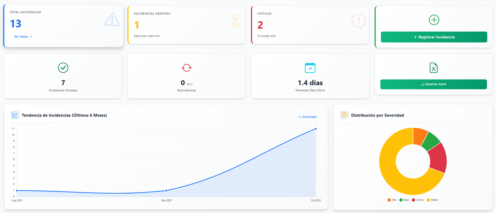
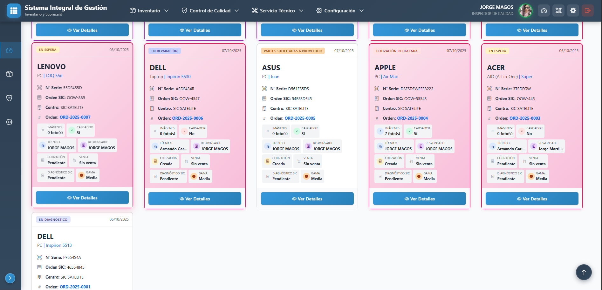
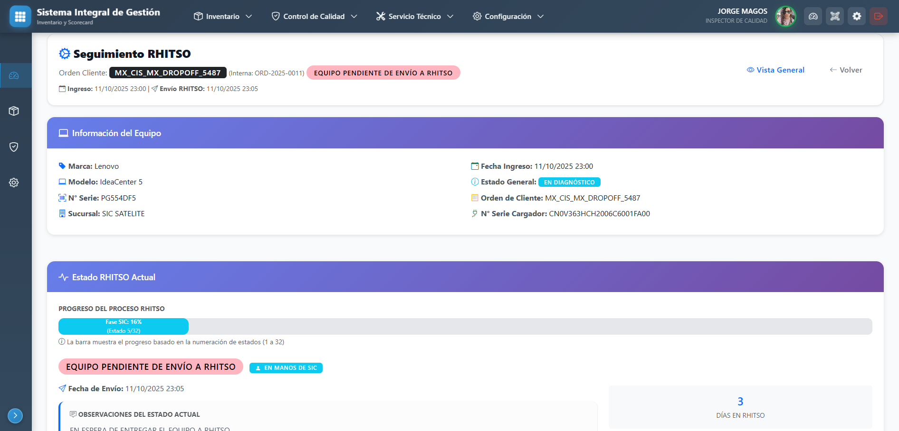
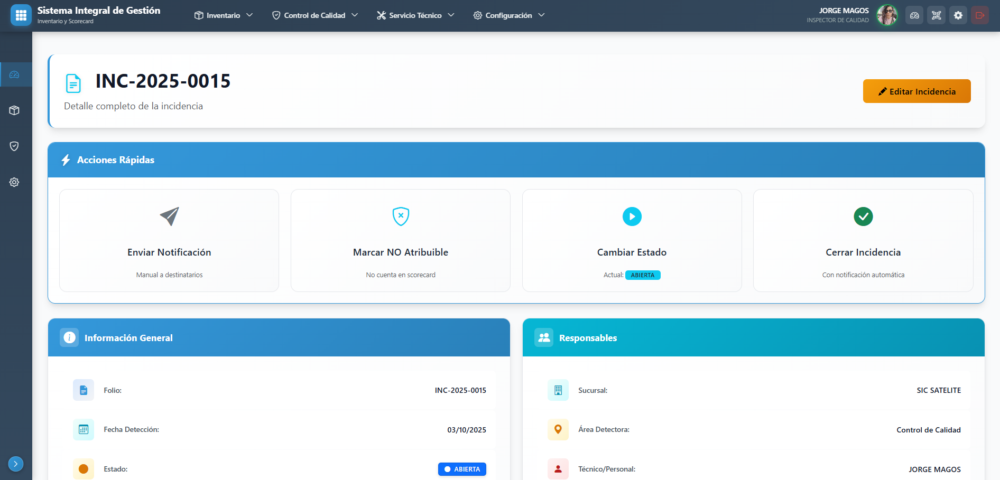
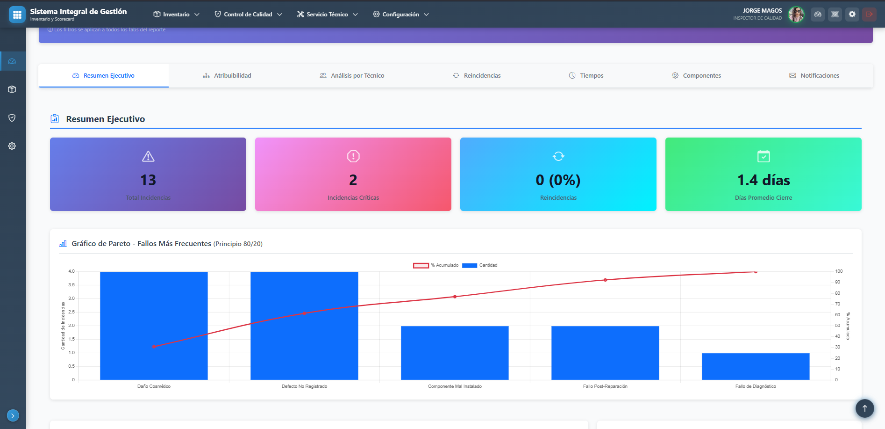
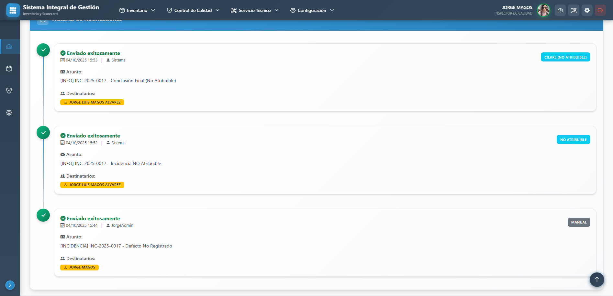

# 🏥 Sistema Integrado de Gestión Técnica y Control de Calidad

<!-- Badges: núcleo del stack (decoración GitHub; la verdad está en requirements.txt / package.json) -->
<p align="center">
  
  
  
  
</p>

<!-- Analytics, ML y cola de tareas -->
<p align="center">
  
  
  
  
  
  
</p>

<!-- Infraestructura y herramientas clave que SIGMA no puede vivir sin -->
<p align="center">
  
  
  
  
  
  
  
</p>

<p align="center">
  
  
  
  
</p>

---

**SIGMA** es un sistema de gestión para **centros de servicio técnico de equipos de cómputo**: órdenes de reparación, control de calidad, almacén/cotizador, evidencia foto/video y seguimiento al cliente.

Incluye analytics (Plotly/pandas), trabajos en segundo plano (Celery + Redis), PWA instalable (staff y portal cliente), arquitectura **multi-país** (BD por tenant) e IA asistida opcional (Ollama / Gemini) para diagnóstico y portal público. Integración **SICSER** en Fase 1 (consulta e importación; sin escrituras externas).

> Producto: **SIGMA v1.0.0** (independiente de la versión de Django).  
> Detalle de módulos, fases y reglas de desarrollo → [`docs/`](./docs/) y [`AGENTS.md`](./AGENTS.md).

---

## Capturas de pantalla

<p align="center">
  
  <br>
  <em>Dashboard Score Card — KPIs y tendencias</em>
</p>

<p align="center">
  
  <br>
  <em>Gestión de órdenes de servicio</em>
</p>

<p align="center">
  
  <br>
  <em>Detalle de orden con seguimiento RHITSO</em>
</p>

<p align="center">
  
  <br>
  <em>Registro de incidencias de calidad</em>
</p>

<p align="center">
  
  <br>
  <em>Reportes avanzados (Pareto, heatmaps, atribuibilidad)</em>
</p>

<p align="center">
  
  <br>
  <em>Historial de notificaciones</em>
</p>

Más capturas y guía de actualización: [`docs/screenshots/`](./docs/screenshots/).

---

## Módulos principales

| App | Rol |
|-----|-----|
| **`servicio_tecnico`** | Núcleo del taller: órdenes, cotizaciones ST, RHITSO, multimedia, encuestas, portal de seguimiento, SICSER |
| **`almacen`** | Inventario central, compras, cotizador (profit / reacondicionados) y sync Almacén ↔ ST |
| **`scorecard`** | Incidencias de calidad, atribuibilidad, reportes y exportación Excel |
| **`inventario`** | Base compartida: sucursales, empleados y legado de productos |
| **`notificaciones`** | Campanita in-app + Web Push (staff y cliente) |

`config/` concentra settings, URLs, Celery, multi-país, PWA y constantes de dominio.

---

## Capacidades clave

- Ciclo de vida de órdenes (22 estados) con piezas WPB/DOA/PNC, venta mostrador e historial
- Cotizador de almacén sincronizado con ST (incl. cotizaciones sin orden y reacondicionados)
- RHITSO: seguimiento de reparaciones externas, PDF y analytics de candidatos
- Score Card: incidencias, reincidencias, reportes multi-tab y notificaciones por correo
- Evidencia multimedia: cámara foto/video, compresión FFmpeg vía Celery, video resumen
- Portal público OOW/FL: timeline, galería, PDF, chat IA opcional, PWA + push del cliente
- PWA staff, dark mode, permisos por grupos Django, django-axes
- Multi-país por subdominio (`mexico`, `argentina`, `chile`, `colombia`) con `db_alias` en Celery
- Dashboards Plotly y predictores ML (scikit-learn) sobre histórico de cotizaciones/rechazos
- SICSER Fase 1: listados e importación a SIGMA (caché Redis; solo lectura hacia SICSER)

---

## En números (aprox., agosto 2026)

| Métrica | Valor |
|---------|-------|
| Apps de negocio | 5 |
| Países / tenants | 4 |
| Estados de orden | 22 |
| Estados RHITSO | 12 |
| Código Python (apps, sin migrations) | ~154 000 LOC |
| TypeScript (`static/ts/`) | ~74 módulos · ~43 000 LOC |
| Templates HTML | ~67 000 LOC |
| Visualizaciones Plotly | 50+ métodos |
| Documentación Markdown en `docs/` | ~75 archivos |
| Scripts en `scripts/` | ~70 |

Las cifras son orientativas (crecen con el repo). El inventario fino de features y fases vive en [`docs/implementaciones/`](./docs/implementaciones/).

---

## Stack

| Capa | Tecnología |
|------|------------|
| Backend | Django 5.2.14 · Python 3.12+ · Celery · Redis |
| Frontend | TypeScript 5.9 · Bootstrap 5.3 · Plotly / Chart.js |
| Datos | SQLite (dev) · PostgreSQL (prod) · multi-BD por país |
| Media / docs | Pillow · FFmpeg · ReportLab · Web Push (`pywebpush`) |
| IA opcional | Ollama local · Google Gemini · scikit-learn |

Dependencias fijadas: [`requirements.lock`](./requirements.lock) · frontend: [`package.json`](./package.json) (`pnpm run build`).

---

## Instalación rápida (desarrollo)

### Requisitos

- Python 3.12+, Node.js 18+, pnpm, Git
- Redis (recomendado; necesario para Celery, cache y varias features async)

### Pasos

```bash
git clone https://github.com/maggots555/inventario-calidad-django.git
cd inventario-calidad-django

python -m venv venv
source venv/bin/activate          # Windows: venv\Scripts\activate

pip install -r requirements.lock  # o requirements.txt si actualizas deps a propósito

cp .env.example .env              # completar SECRET_KEY, email, Redis, etc.

python manage.py migrate
python manage.py createsuperuser

# Datos de ejemplo (opcional)
python scripts/poblado/poblar_sistema.py
python scripts/poblado/poblar_scorecard.py

pnpm install && pnpm run build

python manage.py runserver
```

- App: http://127.0.0.1:8000/  
- Admin: http://127.0.0.1:8000/admin/

Variables y secretos: ver [`.env.example`](./.env.example). Guía de máquina nueva: [`docs/guias/setup/SETUP_NUEVA_MAQUINA.md`](./docs/guias/setup/SETUP_NUEVA_MAQUINA.md).

**Producción / async:** levantar Redis + worker Celery + Beat; checklist en [`docs/PRODUCTION_CHECKLIST.md`](./docs/PRODUCTION_CHECKLIST.md).

---

## Documentación

| Recurso | Contenido |
|---------|-----------|
| [`AGENTS.md`](./AGENTS.md) | Reglas para desarrollo (modularidad, Celery multi-tenant, PWA, tests, dark mode) |
| [`docs/README.md`](./docs/README.md) | Índice de guías e implementaciones |
| [`docs/implementaciones/`](./docs/implementaciones/) | Detalle por módulo (ST, almacén, scorecard, RHITSO, multi-país, …) |
| [`docs/SISTEMA_PERMISOS.md`](./docs/SISTEMA_PERMISOS.md) | Permisos y grupos |
| [`docs/COTIZADOR_PROFIT.md`](./docs/COTIZADOR_PROFIT.md) | Márgenes del cotizador |

### Tests útiles

```bash
python manage.py test almacen
python manage.py test servicio_tecnico.tests
```

---

## Estructura del proyecto (resumen)

```
inventario-calidad-django/
├── config/                 # Settings, URLs, Celery, multi-país, PWA
├── servicio_tecnico/       # App principal ST
├── almacen/                # Cotizador e inventario central
├── scorecard/              # Calidad / incidencias
├── inventario/             # Sucursales, empleados, base legacy
├── notificaciones/         # In-app + Web Push
├── static/ts/              # Fuente TypeScript (compilar → static/js/)
├── templates/              # Plantillas globales
├── docs/                   # Documentación extendida
├── scripts/                # Poblado, verificación, testing manual
├── AGENTS.md               # Guía operativa para agentes / devs
└── manage.py
```

---

## Contribuir

1. Crea una rama desde `main` / tu rama de trabajo.
2. Respeta las reglas de [`AGENTS.md`](./AGENTS.md) (no editar `static/js/` a mano; editar `static/ts/` y `pnpm run build`).
3. Si cambias comportamiento verificable, añade o amplía un test.
4. Abre un PR con descripción clara del *por qué*.

---

## Licencia

Distribuido bajo **GNU GPL v3**. Ver [`LICENSE`](./LICENSE).

---

## Soporte

Issues en el repositorio de GitHub. Documentación operativa y de despliegue en [`docs/`](./docs/).

---

**Objetivo:** digitalizar el flujo del centro de servicio — del ingreso del equipo a la entrega — con calidad, almacén y seguimiento al cliente en un solo sistema.

**Made with Django · SIGMA v1.0.0**
